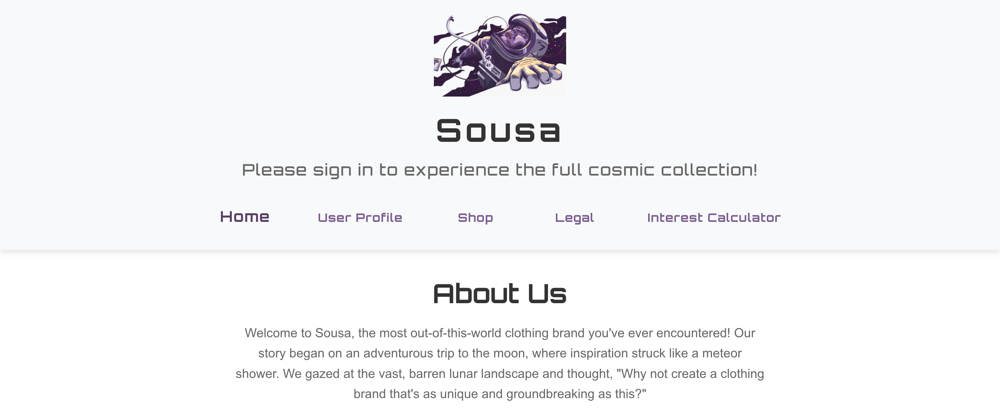

# Sousa - Out-of-this-world Clothing Brand



Welcome to Sousa, the most out-of-this-world clothing brand you've ever encountered! Our mission is to blend the wonders of space exploration with the art of fashion.

## Table of Contents
- [About Us](#about-us)
- [Features](#features)
- [Technologies Used](#technologies-used)
- [Installation](#installation)
- [Usage](#usage)
- [Components](#components)
- [License](#license)
- [Create React App Info](#create-react-app-info)

## About Us
Our story began on an adventurous trip to the moon, where inspiration struck like a meteor shower. We gazed at the vast, barren lunar landscape and thought, "Why not create a clothing brand that's as unique and groundbreaking as this?"

## Features
- User Authentication
- Product Listing
- Interest Calculator
- Legal Information

## Technologies Used
This project is built using [React](https://reactjs.org/), a JavaScript library for building user interfaces. Here are the main technologies and tools used in this project:

- **React Router**: For handling routing between different pages/components.
- **Bootstrap**: For responsive and modern UI design.
- **CSS**: Custom styles to complement Bootstrap and provide additional styling.

## Installation
To get started with the Sousa project, follow these steps:

1. Clone the repository:
```bash
git clone git clone https://github.com/M311HAN/Clothing-Brand.git
```

2. Navigate into the cloned directory with:
```bash
cd Clothing-Brand
```

4. Install the dependencies:
```bash
npm install
```

## Usage
To run the project locally, use the following command:
```bash
npm start
```
This will start the development server and you can view the application in your browser at http://localhost:3000.

## Components
- App.js: Main component with router and state management for user session.

- Header.js: Component that displays the logo, title, and optionally, logout or sign-in messages based on user's login state.

- LandingPage.js: Component that provides information about the company.

- UserProfile.js: Component to handle user profile, conditional rendering based on login status.

- ProductList.js: Component to render a list of products.

- Product.js: Component that displays product information.

- LegalPage.js: Component that displays the legal information for the website.

- InterestCalculatorPage.js: Container for the InterestCalculator component.

- InterestCalculator.js: Component to calculate and display the interest on a shopping total for a specified number of months with a fixed interest rate.

- Footer.js: Component that displays the footer content.

## License
 This project is licensed under the MIT License and created by Melihhan (https://github.com/M311HAN). [Visit the repository](https://github.com/M311HAN?tab=repositories) for more projects and further collaboration.

## Create React App Info

# Getting Started with Create React App

This project was bootstrapped with [Create React App](https://github.com/facebook/create-react-app).

## Available Scripts

In the project directory, you can run:

### `npm start`

Runs the app in the development mode.\
Open [http://localhost:3000](http://localhost:3000) to view it in your browser.

The page will reload when you make changes.\
You may also see any lint errors in the console.

### `npm test`

Launches the test runner in the interactive watch mode.\
See the section about [running tests](https://facebook.github.io/create-react-app/docs/running-tests) for more information.

### `npm run build`

Builds the app for production to the `build` folder.\
It correctly bundles React in production mode and optimizes the build for the best performance.

The build is minified and the filenames include the hashes.\
Your app is ready to be deployed!

See the section about [deployment](https://facebook.github.io/create-react-app/docs/deployment) for more information.

### `npm run eject`

**Note: this is a one-way operation. Once you `eject`, you can't go back!**

If you aren't satisfied with the build tool and configuration choices, you can `eject` at any time. This command will remove the single build dependency from your project.

Instead, it will copy all the configuration files and the transitive dependencies (webpack, Babel, ESLint, etc) right into your project so you have full control over them. All of the commands except `eject` will still work, but they will point to the copied scripts so you can tweak them. At this point you're on your own.

You don't have to ever use `eject`. The curated feature set is suitable for small and middle deployments, and you shouldn't feel obligated to use this feature. However we understand that this tool wouldn't be useful if you couldn't customize it when you are ready for it.

## Learn More

You can learn more in the [Create React App documentation](https://facebook.github.io/create-react-app/docs/getting-started).

To learn React, check out the [React documentation](https://reactjs.org/).

### Code Splitting

This section has moved here: [https://facebook.github.io/create-react-app/docs/code-splitting](https://facebook.github.io/create-react-app/docs/code-splitting)

### Analyzing the Bundle Size

This section has moved here: [https://facebook.github.io/create-react-app/docs/analyzing-the-bundle-size](https://facebook.github.io/create-react-app/docs/analyzing-the-bundle-size)

### Making a Progressive Web App

This section has moved here: [https://facebook.github.io/create-react-app/docs/making-a-progressive-web-app](https://facebook.github.io/create-react-app/docs/making-a-progressive-web-app)

### Advanced Configuration

This section has moved here: [https://facebook.github.io/create-react-app/docs/advanced-configuration](https://facebook.github.io/create-react-app/docs/advanced-configuration)

### Deployment

This section has moved here: [https://facebook.github.io/create-react-app/docs/deployment](https://facebook.github.io/create-react-app/docs/deployment)

### `npm run build` fails to minify

This section has moved here: [https://facebook.github.io/create-react-app/docs/troubleshooting#npm-run-build-fails-to-minify](https://facebook.github.io/create-react-app/docs/troubleshooting#npm-run-build-fails-to-minify)
